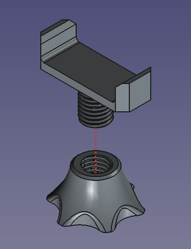
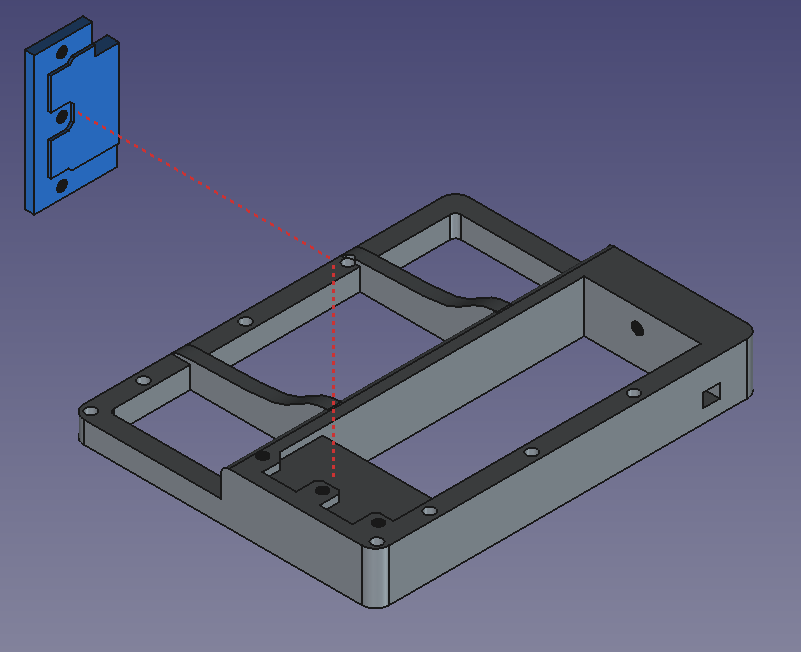
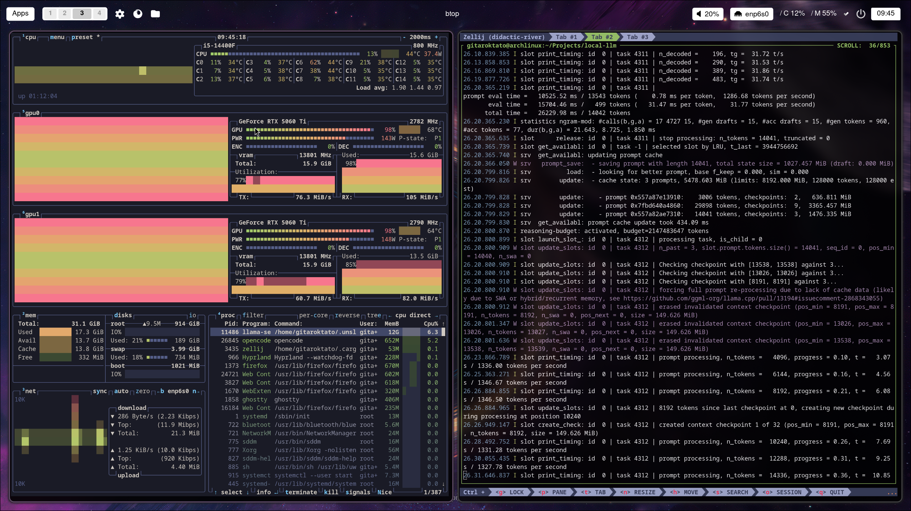

# Local LLM 
A combination of hardware and software capable of running LLMs for coding locally. 

## Execution Environments

- [Arch Linux and Unsloth](./arch-linux-unsloth.md)
- [Windows WSL with vLLM](./windows-wsl-vllm.md)
- 
## Hardware

Full bill of materials (BOM), PCIe topology, riser cables and 3D-printed parts: [hardware-bom.md](./hardware-bom.md)

- CPU: Intel Core i5-14400F · MB: ASUS ROG MAXIMUS Z690 HERO
- GPU: 2× NVIDIA RTX 5060 Ti 16GB (Gen5 x16 + Gen5 x1 riser path)
- RAM: 32GB DDR5-5200 (Kingston FURY Beast) · PSU: ASUS ROG STRIX 1000G

## Images





## Tools

Setting CPU governance

```bash
sudo cpupower frequency-set -g performance
```


## References

- <https://zread.ai/abetlen/llama-cpp-python/20-kv-cache-strategies>
- <https://github.com/ggml-org/llama.cpp/discussions/14758>
